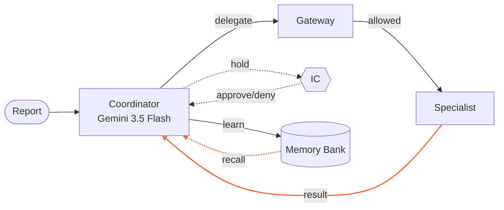
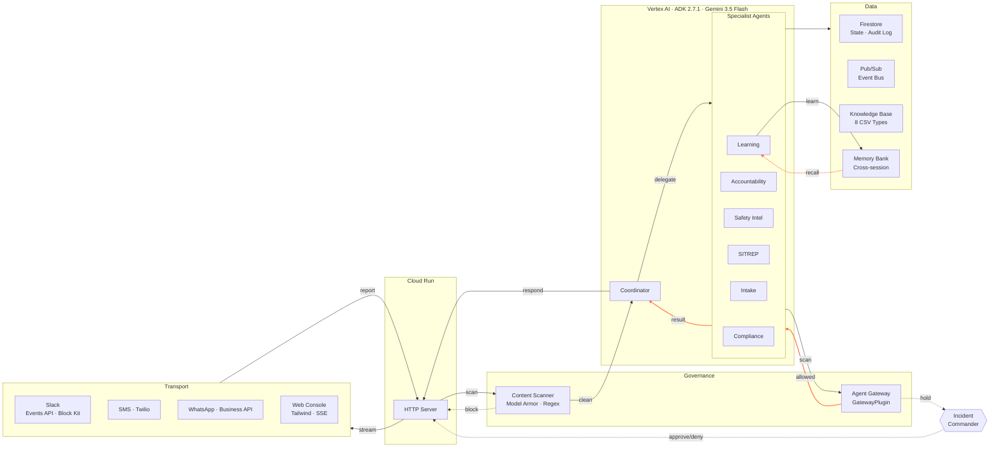

# CrisisMesh Architecture

## Agentic Loop

## Full System

### Edge Provenance

| Edge | Meaning | Source |
|------|---------|--------|
| Transport → HTTP | Incident report enters via Slack, SMS, WhatsApp, or console | `server.py:do_POST` |
| HTTP → Scanner | Raw report scanned at ingress before ADK Runner | `content_scanner.py:ContentScanner.scan_message` |
| Scanner → Coordinator | Clean report enters the ADK Runner | `server.py:_run_agentic` |
| Scanner -.-> HTTP | Blocked report returns 403 | `server.py:do_POST` (blocked branch) |
| Coordinator → Specialists | Coordinator delegates via ADK transfer | `coordinator/agent.py:sub_agents` + `transfer_to_agent` instruction |
| Specialists → Coordinator | Specialist returns result; Coordinator decides next step | ADK Runner loop (implicit return after transfer) |
| Specialists → Gateway | Every tool call intercepted by plugin | `agent_gateway.py:GatewayPlugin.before_tool_callback` |
| Gateway → Specialists | Tool allowed; specialist continues | `agent_gateway.py:GatewayPlugin.before_tool_callback` (returns None) |
| Gateway -.-> IC | Gated action queued as PendingAction | `agent_gateway.py:AgentGateway.check_tool_call` (approval\_gate branch) |
| IC -.-> HTTP | IC approves or denies via REST | `server.py:do_POST /incident/{id}/approve`, `/deny` |
| Specialists → Data | Agents read KB, write Firestore, emit to Pub/Sub | `agents/*/tools.py` (various) |
| Learning → MB | store\_lesson writes at resolve | `learning/tools.py:store_lesson` |
| MB -.-> Learning | find\_similar\_incidents reads at next incident | `learning/tools.py:find_similar_incidents` |
| Coordinator → HTTP | Final response with safety post-processing | `server.py:_run_agentic` → `tactical_reasoning.py:apply_safety_backstop`, `validate_routing_directives` |
| HTTP → Transport | SSE stream, SITREP, Block Kit posted back | `server.py:_stream_agentic_sse`, `slack_transport.py:_run_agentic_and_post` |
