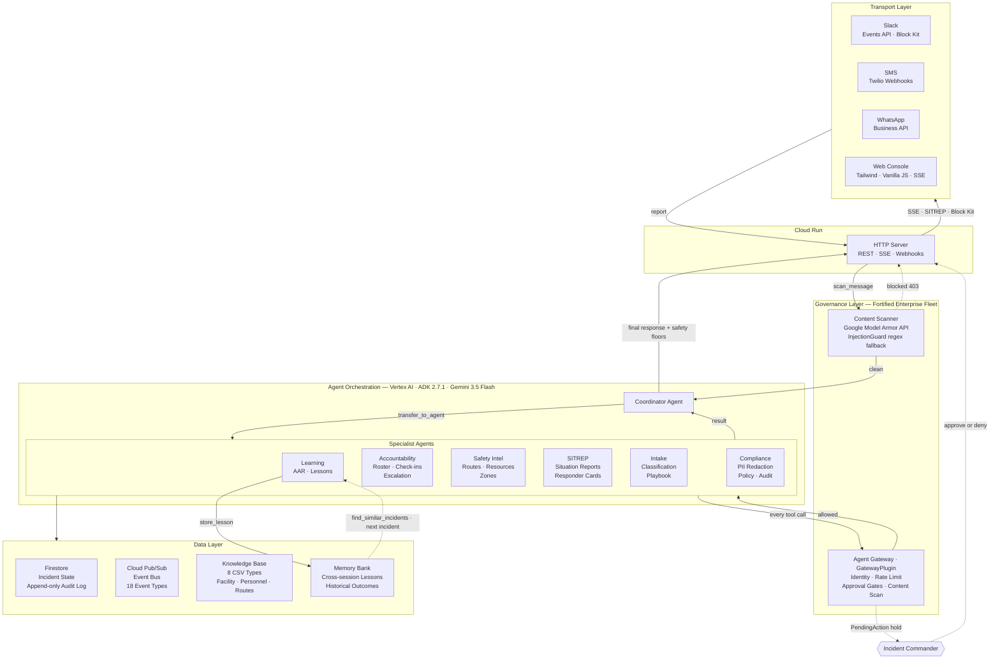

# CrisisMesh Architecture

```mermaid
flowchart TB
    subgraph Transport["Transport Layer"]
        direction LR
        Slack["Slack<br/>Events API · Block Kit"]
        SMS["SMS<br/>Twilio Webhooks"]
        WhatsApp["WhatsApp<br/>Business API"]
        Console["Web Console<br/>Tailwind · Vanilla JS · SSE"]
    end

    subgraph Server["Cloud Run"]
        HTTP["HTTP Server<br/>REST · SSE · Webhooks"]
    end

    subgraph Governance["Governance Layer — Fortified Enterprise Fleet"]
        Scanner["Content Scanner<br/>Google Model Armor API<br/>InjectionGuard regex fallback"]
        Gateway["Agent Gateway · GatewayPlugin<br/>Identity · Rate Limit<br/>Approval Gates · Content Scan"]
    end

    IC{{"Incident Commander"}}

    subgraph Orchestration["Agent Orchestration — Vertex AI · ADK 2.7.1 · Gemini 3.5 Flash"]
        Coordinator["Coordinator Agent"]
        subgraph Specialists["Specialist Agents"]
            direction LR
            Intake["Intake<br/>Classification<br/>Playbook"]
            Accountability["Accountability<br/>Roster · Check-ins<br/>Escalation"]
            SafetyIntel["Safety Intel<br/>Routes · Resources<br/>Zones"]
            SITREP["SITREP<br/>Situation Reports<br/>Responder Cards"]
            Learning["Learning<br/>AAR · Lessons"]
            Compliance["Compliance<br/>PII Redaction<br/>Policy · Audit"]
        end
    end

    subgraph Data["Data Layer"]
        direction LR
        Firestore["Firestore<br/>Incident State<br/>Append-only Audit Log"]
        PubSub["Cloud Pub/Sub<br/>Event Bus<br/>18 Event Types"]
        KB["Knowledge Base<br/>8 CSV Types<br/>Facility · Personnel · Routes"]
        MB["Memory Bank<br/>Cross-session Lessons<br/>Historical Outcomes"]
    end

    %% Ingress — server.py:do_POST /incident, /incident/agentic, /incident/agentic/stream
    Transport -->|report| HTTP
    HTTP -->|scan_message| Scanner

    %% content_scanner.py:ContentScanner.scan_message — ingress gate
    Scanner -->|clean| Coordinator
    Scanner -.->|blocked 403| HTTP

    %% coordinator/agent.py:79-86 — sub_agents list, transfer_to_agent in instruction
    Coordinator -->|transfer_to_agent| Specialists
    Specialists -->|result| Coordinator

    %% agent_gateway.py:443-479 — GatewayPlugin.before_tool_callback on every tool call
    Specialists -->|every tool call| Gateway
    Gateway -->|allowed| Specialists

    %% agent_gateway.py:69-73, 182-244 — PendingAction for gated actions
    Gateway -.->|PendingAction hold| IC
    %% server.py:867-911 — POST /incident/{id}/approve and /deny
    IC -.->|approve or deny| HTTP

    %% Specialist agents read from KB, write to Firestore, emit to PubSub
    Specialists --> Data

    %% learning/tools.py:168-211 — store_lesson at incident resolve
    Learning -->|store_lesson| MB
    %% learning/tools.py:24-92 — find_similar_incidents reads at next incident
    MB -.->|find_similar_incidents · next incident| Learning

    %% server.py:221-222 — apply_safety_backstop + validate_routing_directives
    Coordinator -->|final response + safety floors| HTTP
    HTTP -->|SSE · SITREP · Block Kit| Transport
```
