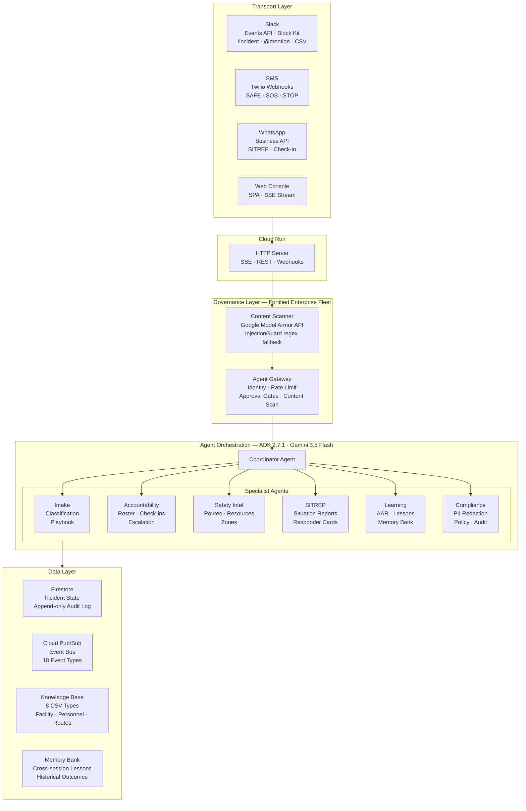

# CrisisMesh Architecture

```mermaid
flowchart TB
    subgraph Transport["Transport Layer"]
        direction LR
        Slack["Slack\nEvents API · Block Kit\n/incident · @mention · CSV"]
        SMS["SMS\nTwilio Webhooks\nSAFE · SOS · STOP"]
        WhatsApp["WhatsApp\nBusiness API\nSITREP · Check-in"]
        Console["Web Console\nSPA · SSE Stream"]
    end

    subgraph Server["Cloud Run"]
        HTTP["HTTP Server\nSSE · REST · Webhooks"]
    end

    subgraph Governance["Governance Layer — Fortified Enterprise Fleet"]
        Scanner["Content Scanner\nGoogle Model Armor API\nInjectionGuard regex fallback"]
        Gateway["Agent Gateway\nIdentity · Rate Limit\nApproval Gates · Content Scan"]
    end

    subgraph Orchestration["Agent Orchestration — ADK 2.7.1 · Gemini 3.5 Flash"]
        Coordinator["Coordinator Agent"]
        subgraph Agents["Specialist Agents"]
            direction LR
            Intake["Intake\nClassification\nPlaybook"]
            Accountability["Accountability\nRoster · Check-ins\nEscalation"]
            SafetyIntel["Safety Intel\nRoutes · Resources\nZones"]
            SITREP["SITREP\nSituation Reports\nResponder Cards"]
            Learning["Learning\nAAR · Lessons\nMemory Bank"]
            Compliance["Compliance\nPII Redaction\nPolicy · Audit"]
        end
    end

    subgraph Data["Data Layer"]
        direction LR
        Firestore["Firestore\nIncident State\nAppend-only Audit Log"]
        PubSub["Cloud Pub/Sub\nEvent Bus\n18 Event Types"]
        KB["Knowledge Base\n8 CSV Types\nFacility · Personnel · Routes"]
        MB["Memory Bank\nCross-session Lessons\nHistorical Outcomes"]
    end

    Transport --> HTTP
    HTTP --> Scanner
    Scanner --> Gateway
    Gateway --> Coordinator
    Coordinator --> Intake
    Coordinator --> Accountability
    Coordinator --> SafetyIntel
    Coordinator --> SITREP
    Coordinator --> Learning
    Coordinator --> Compliance
    Agents --> Data
```
